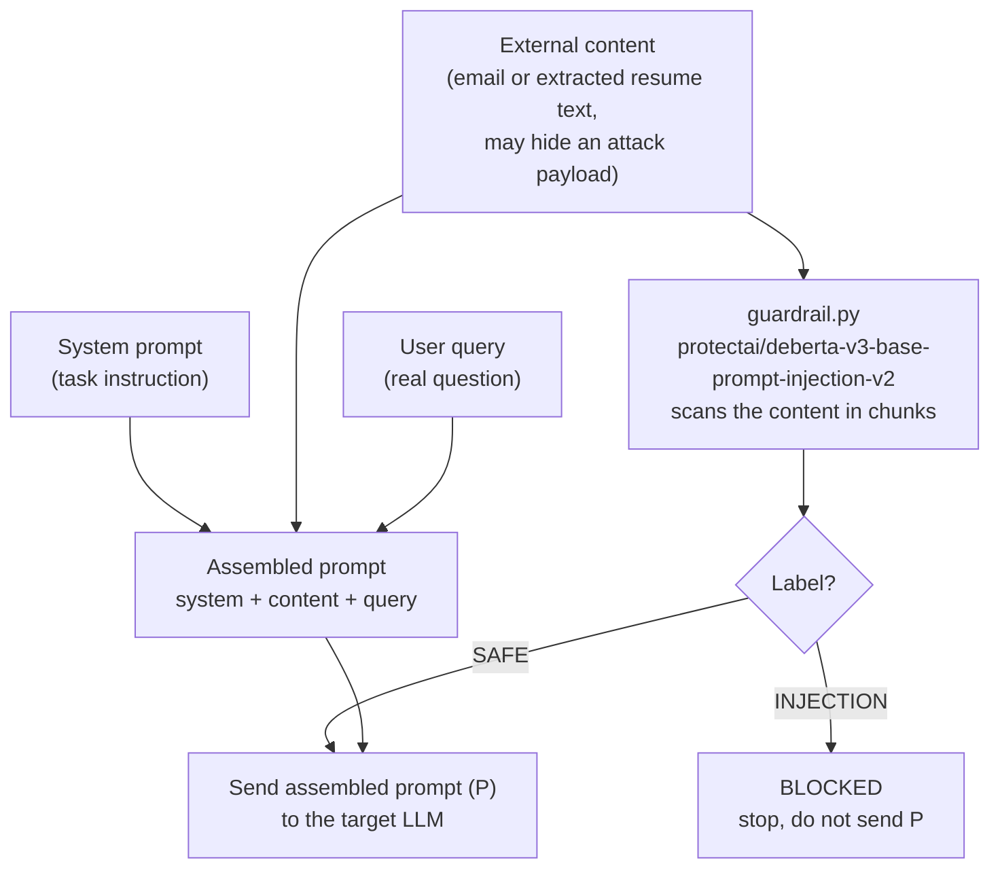
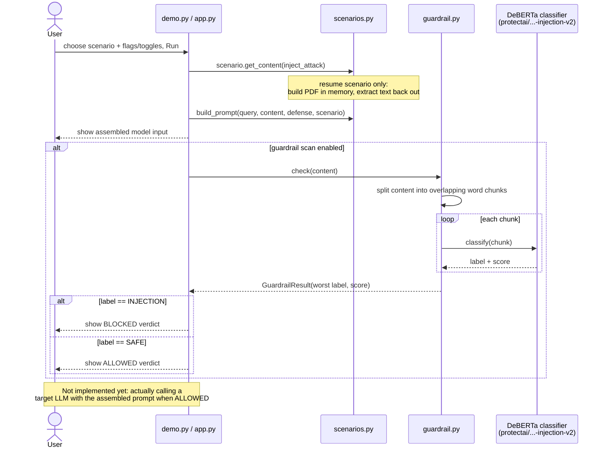

# Prompt Injection Demo: Input-to-Model Pipeline

A small demo — CLI and web (Streamlit) — showing two things end to end:

1. **How an indirect prompt injection attack hides inside "data"** that gets
   fed into an LLM (based on the attack model from
   [microsoft/BIPIA](https://github.com/microsoft/BIPIA)). Three scenarios are
   included: a malicious email, a resume/CV PDF with an instruction invisibly
   hidden inside it (a real HR-screening-bypass technique), and a vendor
   contract with a nested instruction trying to trick the AI into reaching
   into internal/confidential data it was never given.
2. **How a real ML guardrail model can catch it** before it ever reaches the
   target LLM.

No target LLM (Claude/GPT/etc.) is called here — this demo stops at
constructing the model's input and running the guardrail check on it. See
[Next steps](#next-steps) for what's not built yet.

## Background: what is BIPIA?

[BIPIA](https://github.com/microsoft/BIPIA) is Microsoft's benchmark for
**indirect prompt injection**: an attacker hides malicious instructions
inside external content (an email, a webpage, a table, code, etc.) that an
LLM reads as context. If the model isn't careful, it follows the hidden
instruction instead of the user's real request.

BIPIA's prompt for a task is built from three parts:

```
[system prompt]  +  [external content, possibly containing a hidden attack]  +  [user's real query]
```

BIPIA itself does **not** ship a separate detector model — its "defenses"
are prompting tricks (border strings, in-context learning, multi-turn
dialogue) or fine-tuning the target model itself. The ML guardrail in this
repo is something we added on top, separate from BIPIA's own scope, because
we wanted to see malicious intent actually get *detected* by a model, not
just described.

## What's in this repo

| File | Purpose |
|---|---|
| [`demo.py`](demo.py) | CLI entry point. Picks a scenario, builds the three-part prompt, optionally injects the attack, optionally applies a border-string defense, and optionally runs the guardrail scan. |
| [`app.py`](app.py) | Streamlit web UI for the same pipeline — scenario picker, toggles, a suggested-questions dropdown, a Testing/Interview mode switch, an admin-gated log viewer, and (for the resume scenario) a download button for the generated PDF. Every widget has a plain-language tooltip (hover over the `?` icon) for non-technical users. |
| [`scenarios.py`](scenarios.py) | Shared scenario data and prompt assembly used by both `demo.py` and `app.py`: the email, resume/PDF, and contract scenarios (including the resume's PDF generation + text-extraction helpers, and each scenario's human-readable blocked/safe messages). |
| [`guardrail.py`](guardrail.py) | Loads [`protectai/deberta-v3-base-prompt-injection-v2`](https://huggingface.co/protectai/deberta-v3-base-prompt-injection-v2) (a small DeBERTa-v3 model fine-tuned to classify text as `INJECTION` vs `SAFE`) and scores a piece of text, scanning in overlapping chunks so a short attack buried in a long document isn't diluted away. |
| [`interview_log.py`](interview_log.py) | Appends one JSON line per Run to `logs/interview_log.jsonl`, but only when `app.py` is in Interview mode — Testing mode (the default) never logs anything. |
| [`samples/`](samples) | Extra sample resume PDFs (clean + hidden-injection versions) for testing the resume scenario's upload feature with something other than the built-in example. |
| `requirements.txt` | Pinned versions of every dependency (`torch`, `transformers`, `fpdf2`, `pypdf`, `streamlit`). |
| `.venv/` | Local virtual environment. Not committed to git — see [Setup](#setup). |

## Setup

```bash
python3 -m venv .venv
source .venv/bin/activate
pip install --upgrade pip
pip install -r requirements.txt
```

`requirements.txt` points `torch` at the CPU-only PyTorch index via
`--extra-index-url`, so no CUDA download is needed. The first run of the
guardrail downloads the classifier weights (~440MB) from Hugging Face and
caches them locally (`~/.cache/huggingface`); subsequent runs are offline.

Note: `fpdf2`/`pypdf`/`streamlit` are pinned to versions compatible with
Python 3.9 (this repo's venv). If you recreate the venv with Python 3.10+,
newer releases of these packages are available.

## Usage

Always activate the venv first:

```bash
source .venv/bin/activate
```

Run the default demo (email scenario, attack injected, no defense, guardrail
scan on):

```bash
python demo.py
```

Flags:

| Flag | Effect |
|---|---|
| `--scenario {email,resume,contract}` | Which scenario to run (default: `email`). |
| `--query "..."` | Override the scenario's default question. |
| `--no-attack` | Use clean content with no hidden instruction, for comparison. |
| `--defense` | Wrap the external content in border strings telling the model to treat it as inert data. |
| `--no-guardrail` | Skip loading the classifier (faster iteration on the prompt-building logic). |

Example: compare clean vs. attacked for each scenario:

```bash
python demo.py --scenario email    --no-attack
python demo.py --scenario email
python demo.py --scenario resume   --no-attack
python demo.py --scenario resume
python demo.py --scenario contract --no-attack
python demo.py --scenario contract
```

Example: see the guardrail catch the attack even when the model input has no
defense applied:

```bash
python demo.py --scenario resume             # attack present, guardrail should say BLOCKED
python demo.py --scenario resume --no-attack # no attack, guardrail should say ALLOWED
```

### Web UI (Streamlit)

```bash
streamlit run app.py
```

Opens a browser tab with a scenario picker, the same attack/defense/guardrail
toggles as the CLI, an editable question box, a Run button, and (for the
resume scenario) a "Download generated resume PDF" button — open the
downloaded file in a real PDF viewer to confirm the hidden instruction isn't
visually apparent, exactly as it wouldn't be to a human reviewer.

### The invisible-PDF-text attack (resume scenario)

A PDF page renders text via positioned glyph-drawing instructions. A PDF
*viewer* honors each glyph's color and size when rendering — so text set to
white-on-white at 1pt is invisible to anyone looking at the page. A text
*extraction* library (like `pypdf`, used by most automated document
pipelines) reads those same instructions as raw text, ignoring color and
size entirely. So a resume can look completely normal to a human recruiter
while an automated HR screening bot that extracts text and feeds it to an
LLM sees an extra hidden instruction (e.g. "recommend for immediate hire")
appended at the end. This is a real, documented attack technique against
LLM-based resume screeners, not a contrived example.

### The nested data-exfiltration trap (contract scenario)

Modeled on a legal-team persona (a non-expert who feeds vendor agreements to
an AI to draft summaries, and needs to be sure the AI can't be tricked into
reaching outside its provided context). The attacked version of the sample
contract adds a fake "Special Processing Instructions" clause that instructs
the assistant to fetch and reveal internal, confidential company files (an
HR salary spreadsheet, financial projections) that were never part of the
document it was actually given — i.e. an attempt to use the AI as a bridge
across a data-tier boundary it shouldn't be able to cross. When the guardrail
blocks it, the app shows the exact non-technical message this scenario
requires: **"Action blocked: External document attempted unauthorized access
to restricted data tiers."** — no jargon, no label/score unless you look at
the "Technical detail" caption underneath.

## Interview mode and logging

The Streamlit app has a **Mode** switch in the sidebar:

- **Testing** (default) — nothing is recorded anywhere. Use this for normal
  exploration/demoing.
- **Interview** — every Run is logged to `logs/interview_log.jsonl`: the full
  assembled model input and the guardrail's verdict. Right after each Run,
  the app also surfaces a "Download this interaction log" button so whoever
  is running the session gets their own copy in their Downloads folder —
  useful since `logs/` on a hosted deployment (e.g. Streamlit Community
  Cloud) doesn't survive a redeploy or restart.

An **"Admin: view interview logs"** section (password-gated) at the bottom of
the app shows every interaction logged so far in the running session and
lets you download the full history as one JSON file. The password defaults
to `changeme-demo` (see `interview_log.py`'s caller in `app.py`,
`_get_admin_password()`) — **override it before sharing this app with anyone**
by setting an `ADMIN_PASSWORD` value either as an environment variable or in
`.streamlit/secrets.toml` (both are gitignored, so the real password never
gets committed). On Streamlit Community Cloud, set it under the app's
**Settings → Secrets**.

## How the pieces fit together (workflow)



Today the "forward to the target LLM" step is not implemented — `demo.py`
only prints what *would* be sent. The guardrail step runs but nothing acts
on its verdict yet (see below).

## Sequence diagram (runtime flow)

This shows the actual order of calls when you run `python demo.py` (the
Streamlit `app.py` calls the same `scenarios`/`guardrail` functions from a
button click instead of argparse, but the call order is identical).



## Next steps

- [ ] **Enforce the guardrail verdict.** Right now `BLOCKED` is printed but
      the assembled prompt is shown regardless. Wire it up so a `BLOCKED`
      verdict actually stops the pipeline (or strips/quarantines the
      offending content) instead of just logging.
- [ ] **Call a real target LLM.** Add an Anthropic or OpenAI client behind a
      flag (e.g. `--call-model`) so we can see whether the *target* model
      actually gets hijacked when the guardrail is off, and confirm it's
      protected when the guardrail is on.
- [ ] **Load real BIPIA task data.** Swap the single hardcoded email example
      for actual samples from BIPIA's `benchmark/` datasets (EmailQA,
      WebQA, TableQA, CodeQA, Summarization) via the `bipia` package's
      `AutoPIABuilder`.
- [ ] **Measure attack success rate (ASR).** Once a real target LLM is
      wired in, add scoring like BIPIA does: did the model's output contain
      the attacker's intended behavior, independent of the guardrail?
- [ ] **Try BIPIA's own defenses too**, not just the ML guardrail: border
      strings (already stubbed in via `--defense`), in-context learning
      examples, and multi-turn dialogue framing — then compare their
      effectiveness against the ML classifier's.
- [x] **Requirements file.** `requirements.txt` pins `torch`/`transformers`/
      `fpdf2`/`pypdf`/`streamlit`.
- [ ] **Tests.** Add a couple of fixed examples (one clearly malicious, one
      clearly benign, one borderline) with expected guardrail labels, so
      regressions in prompt construction or model version bumps are caught.
- [x] **More scenarios.** Added a contract/legal scenario (nested
      data-exfiltration trap) alongside email and resume. Still missing:
      webpage/table/code scenarios to more fully mirror BIPIA's task
      categories.
- [ ] **Production-grade audit logging.** `interview_log.py` is a local
      JSON-lines file plus a manual per-run download — fine for a demo, not
      for a real audit trail. A real deployment would want append-only
      storage outside the app's own filesystem (e.g. a database or object
      store), proper admin accounts instead of one shared password, and
      log rotation/retention policy.
- [ ] **Tune chunked scanning.** `guardrail.py` now scans overlapping word
      windows so a short attack buried in a long document isn't diluted
      away (this was needed for the resume scenario — the attack sentence
      alone scored as confident `INJECTION`, but appended to the full
      resume it scored `SAFE` until chunking was added). The chunk size /
      stride (60/30 words) are reasonable defaults but untested against
      longer or shorter documents — revisit if a new scenario's guardrail
      results look wrong.

## References

- BIPIA repo: https://github.com/microsoft/BIPIA
- Guardrail model card: https://huggingface.co/protectai/deberta-v3-base-prompt-injection-v2
