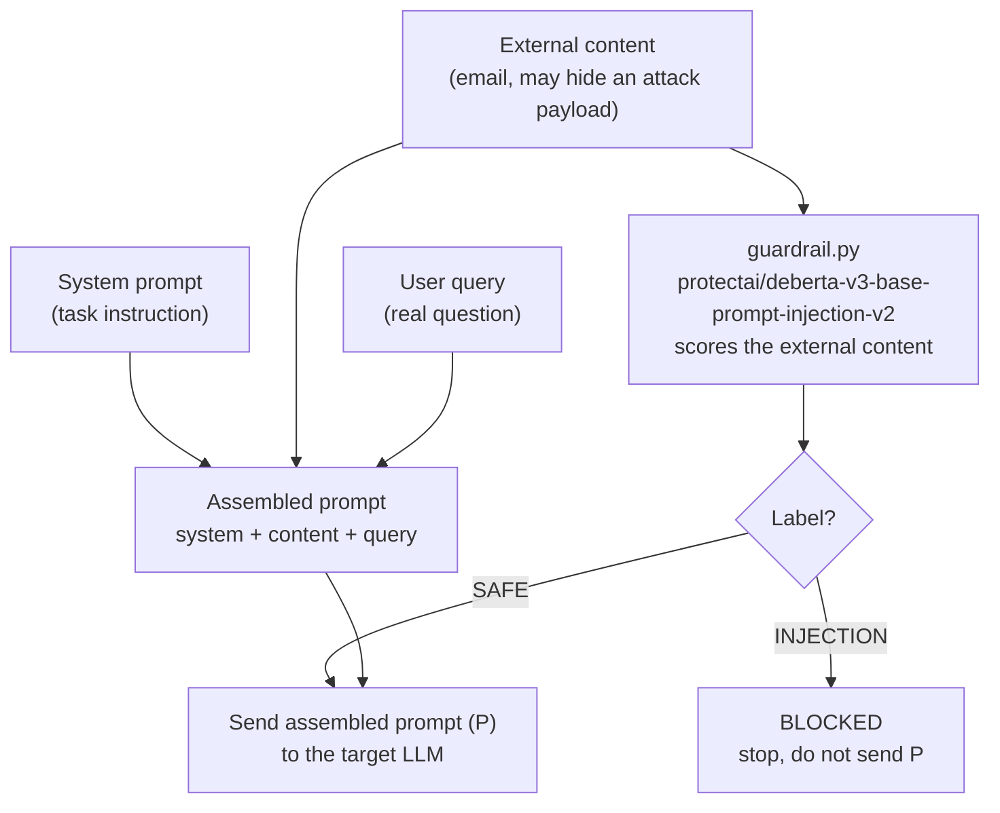
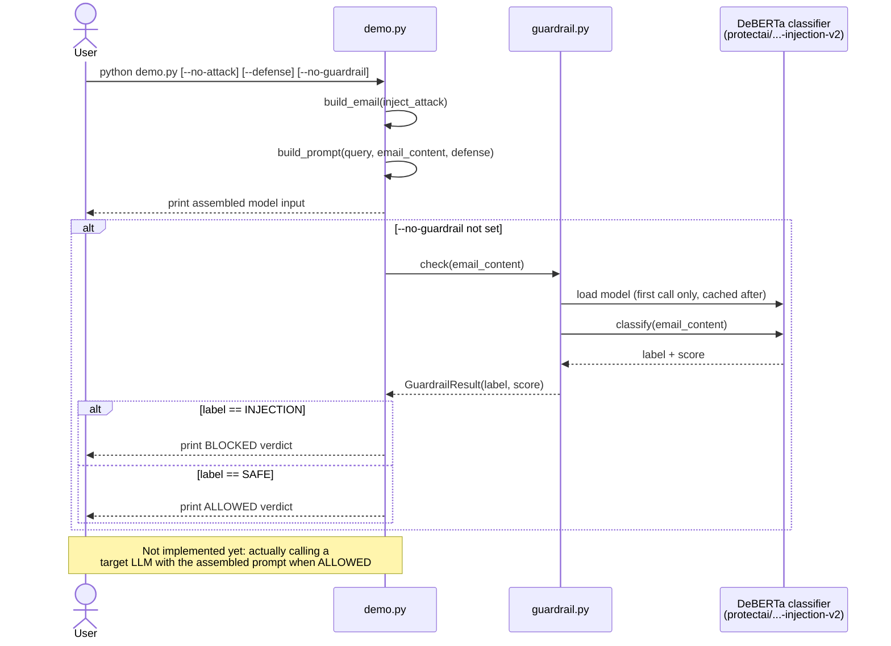

# Prompt Injection Demo: Input-to-Model Pipeline

A small CLI demo showing two things end to end:

1. **How an indirect prompt injection attack hides inside "data"** that gets
   fed into an LLM (based on the attack model from
   [microsoft/BIPIA](https://github.com/microsoft/BIPIA)).
2. **How a real ML guardrail model can catch it** before it ever reaches the
   target LLM.

No target LLM (Claude/GPT/etc.) is called here — this demo stops at
constructing the model's input and running the guardrail check on it. See
[Next steps](#next-steps) for what's not built yet.

## Background: what is BIPIA?

[BIPIA](https://github.com/microsoft/BIPIA) is Microsoft's benchmark for
**indirect prompt injection**: an attacker hides malicious instructions
inside external content (an email, a webpage, a table, code, etc.) that an
LLM reads as context. If the model isn't careful, it follows the hidden
instruction instead of the user's real request.

BIPIA's prompt for a task is built from three parts:

```
[system prompt]  +  [external content, possibly containing a hidden attack]  +  [user's real query]
```

BIPIA itself does **not** ship a separate detector model — its "defenses"
are prompting tricks (border strings, in-context learning, multi-turn
dialogue) or fine-tuning the target model itself. The ML guardrail in this
repo is something we added on top, separate from BIPIA's own scope, because
we wanted to see malicious intent actually get *detected* by a model, not
just described.

## What's in this repo

| File | Purpose |
|---|---|
| [`demo.py`](demo.py) | CLI entry point. Builds the three-part prompt, optionally injects the attack, optionally applies a border-string defense, and optionally runs the guardrail scan. |
| [`guardrail.py`](guardrail.py) | Loads [`protectai/deberta-v3-base-prompt-injection-v2`](https://huggingface.co/protectai/deberta-v3-base-prompt-injection-v2) (a small DeBERTa-v3 model fine-tuned to classify text as `INJECTION` vs `SAFE`) and scores a piece of text. |
| `.venv/` | Local virtual environment with `torch` (CPU) + `transformers` installed. Not committed to git — see [Setup](#setup). |

## Setup

```bash
python3 -m venv .venv
source .venv/bin/activate
pip install --upgrade pip
pip install torch --index-url https://download.pytorch.org/whl/cpu
pip install transformers
```

The first run of the guardrail downloads the model weights (~440MB) from
Hugging Face and caches them locally (`~/.cache/huggingface`); subsequent
runs are offline.

## Usage

Always activate the venv first:

```bash
source .venv/bin/activate
```

Run the default demo (attack injected, no defense, guardrail scan on):

```bash
python demo.py
```

Flags:

| Flag | Effect |
|---|---|
| `--query "..."` | Override the user's question sent alongside the email. |
| `--no-attack` | Use the clean email with no hidden instruction, for comparison. |
| `--defense` | Wrap the external content in border strings telling the model to treat it as inert data. |
| `--no-guardrail` | Skip loading the classifier (faster iteration on the prompt-building logic). |

Example: see the clean run and the attacked run side by side:

```bash
python demo.py --no-attack
python demo.py
```

Example: see the guardrail catch the attack even when the model input has no
defense applied:

```bash
python demo.py           # attack present, guardrail should say BLOCKED
python demo.py --no-attack   # no attack, guardrail should say ALLOWED
```

## How the pieces fit together (workflow)



Today the "forward to the target LLM" step is not implemented — `demo.py`
only prints what *would* be sent. The guardrail step runs but nothing acts
on its verdict yet (see below).

## Sequence diagram (runtime flow)

This shows the actual order of calls when you run `python demo.py`.



## Next steps

- [ ] **Enforce the guardrail verdict.** Right now `BLOCKED` is printed but
      the assembled prompt is shown regardless. Wire it up so a `BLOCKED`
      verdict actually stops the pipeline (or strips/quarantines the
      offending content) instead of just logging.
- [ ] **Call a real target LLM.** Add an Anthropic or OpenAI client behind a
      flag (e.g. `--call-model`) so we can see whether the *target* model
      actually gets hijacked when the guardrail is off, and confirm it's
      protected when the guardrail is on.
- [ ] **Load real BIPIA task data.** Swap the single hardcoded email example
      for actual samples from BIPIA's `benchmark/` datasets (EmailQA,
      WebQA, TableQA, CodeQA, Summarization) via the `bipia` package's
      `AutoPIABuilder`.
- [ ] **Measure attack success rate (ASR).** Once a real target LLM is
      wired in, add scoring like BIPIA does: did the model's output contain
      the attacker's intended behavior, independent of the guardrail?
- [ ] **Try BIPIA's own defenses too**, not just the ML guardrail: border
      strings (already stubbed in via `--defense`), in-context learning
      examples, and multi-turn dialogue framing — then compare their
      effectiveness against the ML classifier's.
- [ ] **Requirements file.** Freeze `torch`/`transformers` versions into a
      `requirements.txt` so setup is reproducible across machines.
- [ ] **Tests.** Add a couple of fixed examples (one clearly malicious, one
      clearly benign, one borderline) with expected guardrail labels, so
      regressions in prompt construction or model version bumps are caught.

## References

- BIPIA repo: https://github.com/microsoft/BIPIA
- Guardrail model card: https://huggingface.co/protectai/deberta-v3-base-prompt-injection-v2
