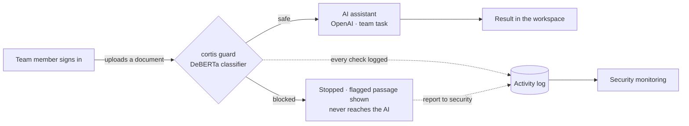

# cortis — Document Safety Check

**cortis is a prompt-injection guard that sits in front of an AI assistant.** A team member
signs in, uploads their everyday documents (CVs, contracts, invoices), and cortis screens each
one for hidden instructions — a *prompt-injection* attack — **before** any of it reaches the
AI. Safe documents get an AI result tuned to the team's job; dangerous ones are blocked and
never touch the model. It is built for **non-technical staff**: every verdict is in plain
language, in English or Tiếng Việt.

> The product requirements, goals, and the usability framework it's designed against live in
> **[SRS.md](SRS.md)** (the Software Requirements Specification). This README is about the
> system itself — how it works and how to run it.

---

## How it works



1. **Sign in** as a team member (passwordless demo picker). You land in a workspace tuned to
   your team.
2. **Add documents** — upload your own files (PDF, Word, or text; up to 10 at a time) or add a
   built-in sample.
3. **Screen** — the guard (a local DeBERTa-v3 classifier) scores each document for prompt
   injection. It scans in small overlapping segments so a short hidden instruction buried in a
   long, benign document isn't diluted.
4. **Decide & explain** — each document becomes a row in a results table:
   - **Safe** → forwarded to the AI assistant for the team's task, and the result is shown.
   - **Blocked** → stopped before the AI, with the **exact flagged passage** quoted in plain
     language and a next step. The AI never sees it.
5. **Report & monitor** — any result can be flagged to Security (false positive / real threat /
   possible miss). Every check and report flows into the **Security monitoring** dashboard.

### Roles & workspaces

| Account | Team | Workspace |
|---|---|---|
| Sophia Tran | HR | **Candidate screening** — upload a job description + up to 10 CVs → each CV is screened, then rated for fit against the JD. Results ranked, exportable to CSV. |
| Nghia Le | Legal | **Contract review** — upload contracts (or add samples) → each is screened, then summarised (parties, obligations, risk flags). |
| Long Vu | Finance | **Invoice processing** — upload invoices → each is screened, then key figures are extracted for payment. |
| An Tran | Security | **Monitoring** — org-wide activity: totals, blocks by team, what was blocked, and reports raised by other teams. |

Each workspace only sees its own team's documents; cross-team access is blocked. Every screen
has an **English / Tiếng Việt** toggle, a first-run onboarding banner, and per-workspace **Help**.

### Architecture

- **Backend** — [FastAPI](https://fastapi.tiangolo.com/) (`app/main.py`): auth/session, the
  `/api/check` screening endpoint, batch upload handling, the report feedback loop, and the
  monitoring API.
- **Guard** (`app/guard.py`) — the off-the-shelf classifier
  [`protectai/deberta-v3-base-prompt-injection-v2`](https://huggingface.co/protectai/deberta-v3-base-prompt-injection-v2),
  run locally on CPU via PyTorch/Transformers. It turns the raw score into a plain-language
  verdict and names the *kind* of attack to word the explanation.
- **AI assistant** (`app/assistant.py`) — calls OpenAI (`gpt-4o-mini` by default) for the
  team's downstream task, and **only ever on documents the guard marked safe**.
- **Activity log** (`app/logstore.py`) — an append-only JSONL of every check + every report,
  plus the aggregates the monitoring view reads.
- **Frontend** (`app/static/`) — plain HTML/CSS/JS, no framework: `login`, `workspace` (shared,
  adapts per role), `monitoring`, and `i18n.js` (EN/VI).

```
app/
├── main.py          FastAPI routes (auth, check, report, monitoring)
├── guard.py         DeBERTa classifier → plain-language verdict
├── assistant.py     OpenAI downstream task (safe documents only)
├── workspaces.py    accounts, teams, sample docs, per-team AI task
├── logstore.py      append-only activity log + monitoring aggregates
├── extract.py       text extraction from PDF / DOCX / TXT uploads
├── config.py        environment configuration
└── static/          login · workspace · monitoring · i18n · styles
samples/{hr,legal,finance}/   demo documents (neutral filenames)
scripts/download_model.py     bakes the model into the Docker image
Dockerfile · Makefile · requirements.txt · requirements-engine.txt
```

---

## Run it locally

### Option A — Docker (recommended)

The image bakes the detection model in, so it runs fully offline after the build.

```bash
make run            # builds the image and starts it on http://localhost:8000
```

(or without make: `docker build -t cortis . && docker run -p 8000:8000 -v cortis-data:/app/data cortis`)

Then open **http://localhost:8000** and sign in as any account. `make run` mounts a
`cortis-data` volume so the activity log survives restarts. Other targets: `make build`,
`make stop`, `make logs`.

**Enable the AI assistant (optional).** The guard works with no key. To turn on the downstream
AI result on safe documents, put your OpenAI key in a git-ignored `.env` and re-run:

```bash
echo "OPENAI_API_KEY=sk-..." > .env
make run            # the Makefile passes .env into the container
```

### Option B — without Docker (local dev)

Useful for editing the frontend (uvicorn serves the live files, no rebuild):

```bash
python -m venv .venv && source .venv/bin/activate
pip install -r requirements.txt
python scripts/download_model.py               # one-time: caches the DeBERTa model (~750 MB)

export CORTIS_LOG_PATH=./data/activity.jsonl   # the default (/app/data) is Docker-only
export OPENAI_API_KEY=sk-...                    # optional (enables the AI assistant)
uvicorn app.main:app --host 127.0.0.1 --port 8000
```

> The first request loads the model into memory — give it a few seconds. The repo needs
> ~2 GB RAM free to hold PyTorch + the model.

### Configuration

All optional except where noted. Set them as environment variables (or in `.env` for Docker).

| Variable | Default | Purpose |
|---|---|---|
| `OPENAI_API_KEY` | — | Enables the AI assistant on safe documents. Guard works without it. |
| `CORTIS_SECRET_KEY` | dev placeholder | **Set in production** — signs the session cookie. Use a long random string. |
| `CORTIS_LOG_PATH` | `/app/data/activity.jsonl` | Where the activity log is written. Override for non-Docker runs. |
| `CORTIS_BLOCK_THRESHOLD` | `0.5` | Injection probability at/above which a document is blocked. |
| `CORTIS_ASSISTANT_MODEL` | `gpt-4o-mini` | OpenAI model for the downstream task. |
| `CORTIS_MODEL_ID` | `protectai/deberta-v3-base-prompt-injection-v2` | The detection model. |
| `CORTIS_MAX_UPLOAD_BYTES` | `5242880` (5 MB) | Per-file upload cap. |

The app listens on **port 8000**. Health check: `GET /api/health`.

---

## Deploy to the cloud

cortis is a standard Dockerized FastAPI service, so it runs on any platform that can run a
container. It needs **≥ 2 GB RAM** (PyTorch + the model) and, for a persistent activity log, a
disk mounted at `/app/data`.

### Docker-based hosts (recommended)

Works on **Render, Railway, Fly.io, Google Cloud Run, AWS App Runner, Azure Container Apps**,
or any VM with Docker. General recipe:

1. Push this repo to GitHub. The platform auto-detects the `Dockerfile`.
2. Set environment variables (as secrets): **`OPENAI_API_KEY`** and a strong
   **`CORTIS_SECRET_KEY`**.
3. Give the instance **≥ 2 GB RAM**. The first build downloads the model into the image
   (~2.8 GB) — allow a few minutes.
4. (Optional) Attach a persistent disk mounted at **`/app/data`** so the activity log survives
   redeploys, or point `CORTIS_LOG_PATH` at it.
5. Deploy. Point the platform's health check at **`/api/health`**.

**Port note.** The container listens on `8000`. Platforms that inject a `$PORT` (e.g. Cloud
Run, which defaults to `8080`) need the start command overridden to bind it:

```bash
python -m uvicorn app.main:app --host 0.0.0.0 --port $PORT
```

Example — Google Cloud Run:

```bash
gcloud run deploy cortis --source . \
  --memory 2Gi --port 8000 \
  --set-env-vars OPENAI_API_KEY=sk-...,CORTIS_SECRET_KEY=$(openssl rand -hex 32)
```

### Streamlit Community Cloud — not supported as-is

Streamlit Community Cloud runs a single `streamlit run app.py` entrypoint, caps free apps at
about **1 GB RAM**, and **can't run Docker or a FastAPI/uvicorn server**. This project is a
FastAPI service with a ~2.8 GB image and a local PyTorch model, so it **cannot be deployed
there directly**.

Running on Streamlit Cloud would mean building a **different app**: a Streamlit UI that calls a
**hosted** inference endpoint for the injection model (e.g. the
[Hugging Face Inference API](https://huggingface.co/docs/api-inference)) instead of loading it
locally, plus the OpenAI call — a separate, lighter frontend. If that's the target you need,
it's a small standalone build; ask and it can be added alongside this one.

---

## Notes

- **Sign-in is a passwordless demo picker** — swap in real SSO/password auth for production.
  It intentionally lists the four roles so a usability test (or demo) can move between them.
- **Sample documents** live in [`samples/{hr,legal,finance}/`](samples/) with neutral filenames
  so a test participant can't guess the answer. Regenerate the PDF résumés with
  `python scripts/build_sample_pdfs.py` (needs `fpdf2`).
- **The guard is an off-the-shelf model.** It can false-positive on very formal boilerplate
  (e.g. archaic legal phrasing) — the "Report to Security" action gives users a path to flag
  that, which is a genuine usability finding, not something hidden.
- **Product spec & usability framework:** see **[SRS.md](SRS.md)**.
